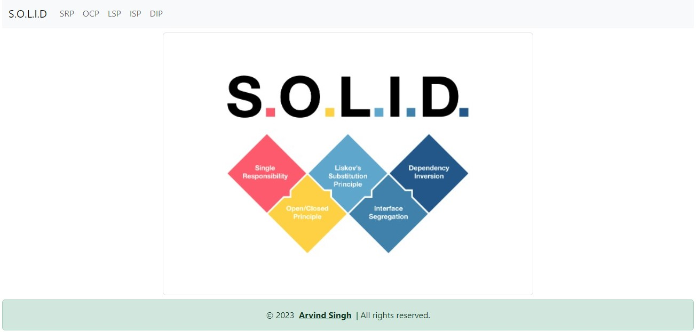
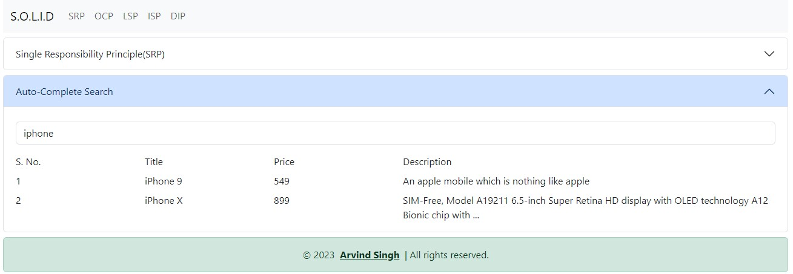
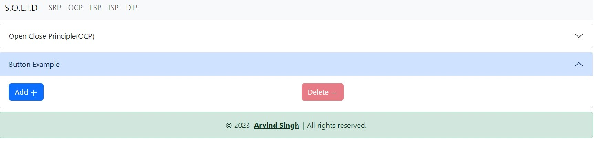
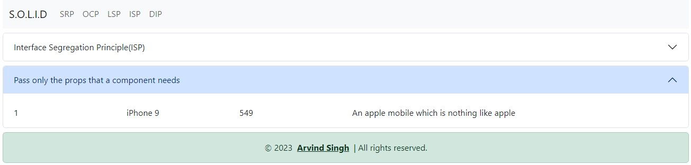
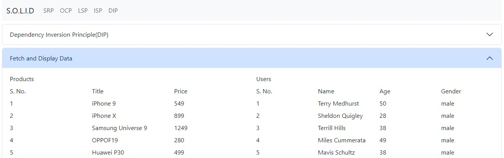

# S.O.L.I.D Principles scenarios in React
This is a sample application to create scenarios w.r.t S.O.L.I.D principles

# Single Responsibility Principle(SRP)

# OOpen Close Principle(OCP)

# Liskov Substitution Principle(LSP)

# Interface Segregation Principle(ISP)

# Dependency Inversion Principle(DIP)
